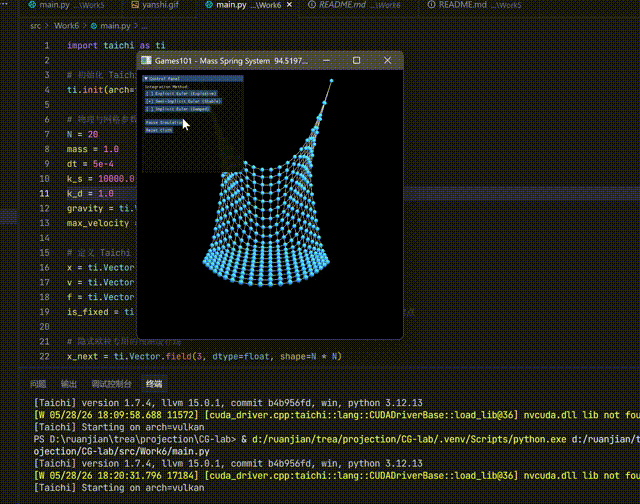
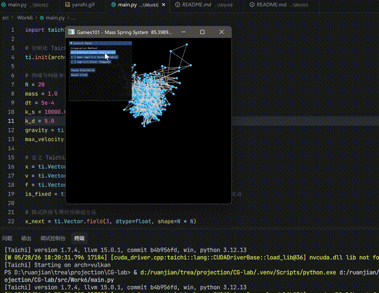

# 第七次作业
##202411081058
##易相宇
## 效果演示




## 项目架构

本项目采用模块化设计，主要包含以下文件：

- `src/Work6/main.py`：项目主入口，实现基于质点-弹簧系统的布料模拟

## 代码逻辑

1. **初始化**：
   - 使用 Taichi 库初始化 GPU 环境
   - 创建 N×N 的布料网格，质点均匀分布在 XY 平面
   - 固定第一排的两个角点作为悬挂点
   - 初始化弹簧对，建立结构弹簧连接

2. **力计算**：
   - 计算重力：`f = gravity * mass`
   - 计算阻尼力：`f -= k_d * velocity`
   - 计算弹簧力：基于胡克定律，使用 `atomic_add` 保证线程安全

3. **数值积分**：
   - **显式欧拉**：先用旧速度更新位置，再用旧力更新速度（易发散）
   - **半隐式欧拉**：先用旧力更新速度，再用新速度更新位置（相对稳定）
   - **隐式欧拉**：使用定点迭代法近似求解未来状态（最稳定）

4. **速度钳制**：
   - 设置最大速度限制，防止数值爆炸

5. **可视化**：
   - 使用 GGUI 渲染网格顶点和弹簧线框
   - 支持相机交互和三种积分方法切换

## 实现功能

- **质点-弹簧系统**：实现基于弹簧模型的布料物理模拟
- **三种积分方法**：显式欧拉、半隐式欧拉、隐式欧拉对比
- **速度钳制**：防止数值发散
- **GPU 加速**：利用 Taichi 的 GPU 并行计算能力
- **实时交互**：支持暂停/恢复、重置、相机控制
- **方法切换**：运行时可切换不同积分方法

## 技术特点

1. **GPU 并行计算**：使用 Taichi 的 GPU 后端加速物理模拟
2. **原子操作**：使用 `atomic_add` 保证多线程环境下的力累加安全
3. **定点迭代**：隐式欧拉采用定点迭代法近似求解
4. **合并 kernel**：将力计算和积分合并在单个 kernel 中，减少 GPU 启动开销
5. **速度钳制**：通过 `max_velocity` 防止数值爆炸

## 运行方式

在项目根目录下运行：

```bash
python src/Work6/main.py
```

运行后会弹出一个窗口，显示布料模拟效果和控制面板：

- **Explicit Euler (Explosive)**：显式欧拉方法，时间步长较大时容易发散
- **Semi-Implicit Euler (Stable)**：半隐式欧拉方法，相对稳定，推荐使用
- **Implicit Euler (Damped)**：隐式欧拉方法，最稳定但有阻尼效果

**交互说明**：
- 点击按钮切换积分方法（切换时会重置布料状态）
- 支持暂停/恢复模拟
- 支持重置布料到初始状态
- 按住鼠标右键拖动可旋转视角

程序默认使用半隐式欧拉方法，每帧执行 40 个子步（总时间步长约 0.02s/帧），实现接近实时的布料模拟效果。
